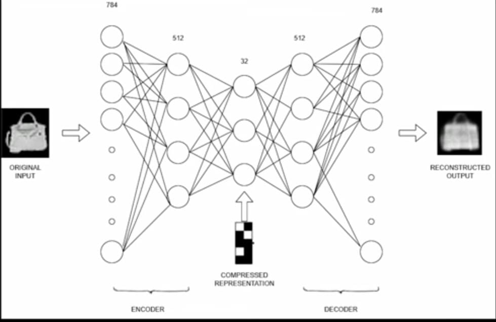

# 🌟 Generative AI Portfolio

## 🔍 Introduction to Generative AI

Generative AI refers to a class of artificial intelligence models that can generate new content — such as **text, images, audio, video**, or **code** — that resembles human-created data. Unlike traditional AI systems that classify or predict existing data, generative AI **learns the patterns** of the data and **creates new meaningful content**.

---

## ⚙️ How Generative AI Works

Generative AI models learn a **probability distribution** over the training data. During inference, they sample from this distribution to generate new outputs.

### Process:

1. **Training:** The model learns from large datasets (images, text, audio, etc.).
2. **Generation:** It creates new examples that mimic the training data.

---

## 🧠 Generative AI Models

🔹 <strong>Autoencoders</strong>

Designed and implemented a fully connected autoencoder neural network for unsupervised feature learning, with a focus on image compression and reconstruction. The model was trained on the Fashion MNIST dataset, enabling it to learn compact, lower-dimensional representations of grayscale fashion images. These compressed representations were then used to accurately reconstruct the original inputs, demonstrating the model’s ability to retain essential visual features while reducing dimensionality.

Architecture :
1. Input Dimension: 784 (28×28 grayscale image flattened)
2. Encoder:
    Dense Layer 1: 512 neurons with ReLU activation
    Dense Layer 2: 32 neurons (bottleneck layer)
3. Latent Space:
    32-dimensional compressed representation capturing the essential features of the input image .
4. Decoder:
   Dense Layer 1: 512 neurons with ReLU activation
   Output Layer: 784 neurons with Sigmoid activation (reshaped to 28×28)
   Loss Function: Mean Squared Error (MSE)
5. Optimizer: Adam

Functional Flow :
1 . Input: Grayscale fashion image (e.g., handbag) is provided as input to the encoder.
2 . Encoding: The encoder compresses the input from 784 to 32 dimensions, capturing key visual features.
3 .  Decoding: The decoder reconstructs the original image from this compressed representation.
4 . Output: A reconstructed version of the original image is generated, maintaining visual similarity while discarding redundant information.

Key Benefits and Applications  :
1. Dimensionality Reduction: Compresses high-dimensional input images into a compact latent space.
2. Feature Learning: Learns meaningful, low-dimensional representations without supervision.
3. Denoising Capability: Robust against noise, enabling cleaner reconstructions.
4. Efficient Storage & Transmission: Reduced data size makes it suitable for memory-constrained systems.
5. Foundation for Generative Models: Can be extended into advanced models such as Variational Autoencoders (VAEs).

**Output Example:**  

🔗 [View Autoencoder Project](./autoencoder/README.md)

---

🔹 <strong>GANs (Generative Adversarial Networks)</strong>

GANs consist of two networks — a **Generator** and a **Discriminator** — that compete in a zero-sum game to improve image generation.

**Use Cases:**
- Image synthesis
- Super-resolution
- Deepfake generation

**Output Example:**  

🔗 [View GAN Project](./gan/README.md)

---

🔹 <strong>CycleGAN</strong>

CycleGAN enables image-to-image translation **without paired data**.

**Use Cases:**
- Photo ↔ Painting
- Horse ↔ Zebra
- Summer ↔ Winter

**Output Example:**  

🔗 [View CycleGAN Project](./cyclegan/README.md)

---

🔹 <strong>Conditional GAN (cGAN)</strong>

cGANs are conditioned on input variables like class labels to generate class-specific outputs.

**Use Cases:**
- Digit generation by label
- Face synthesis from attributes
- Text-to-image synthesis

**Output Example:**  

🔗 [View Conditional GAN Project](./cgan/README.md)

---

🔹 <strong>Diffusion Models</strong>

Diffusion models learn to reverse a noise process to generate highly detailed images. Used in models like **Stable Diffusion** and **Imagen**.

**Use Cases:**
- Text-to-image generation
- Inpainting
- AI-generated artwork

**Output Example:**  

🔗 [View Diffusion Model Project](./diffusion/README.md)

---

🔹 <strong>ViT (Vision Transformer)</strong>

ViT splits an image into patches and applies transformer encoders on them — treating image patches like tokens in NLP.

**Use Cases:**
- Image classification
- Object detection
- Medical image analysis

**Output Example:**  

🔗 [View ViT Project](./vit/README.md)

---

🔹 <strong>BERT (Bidirectional Encoder Representations from Transformers)</strong>

BERT is a transformer model trained on masked language modeling and next sentence prediction.

**Use Cases:**
- Sentiment analysis
- Q&A systems
- Named Entity Recognition (NER)

**Output Example:**  

🔗 [View BERT Project](./bert/README.md)

---

🔹 <strong>LLMs (Large Language Models)</strong>

LLMs like GPT, LLaMA, and Claude are trained on billions of tokens and used for generative text tasks.

**Use Cases:**
- Text generation
- Summarization
- Translation
- Code generation

**Output Example:**  

🔗 [View LLM Project](./llm/README.md)

---

